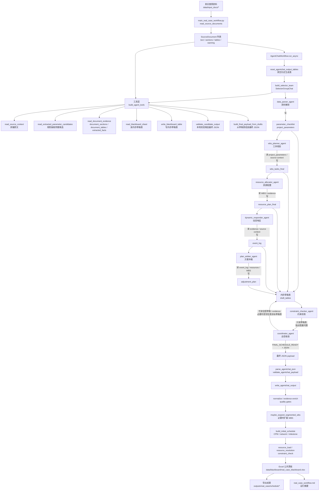
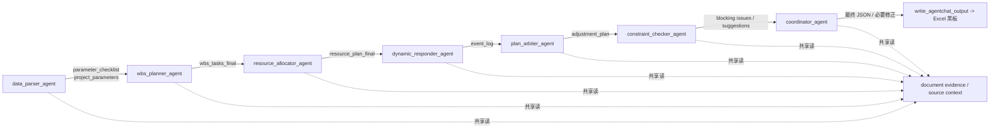
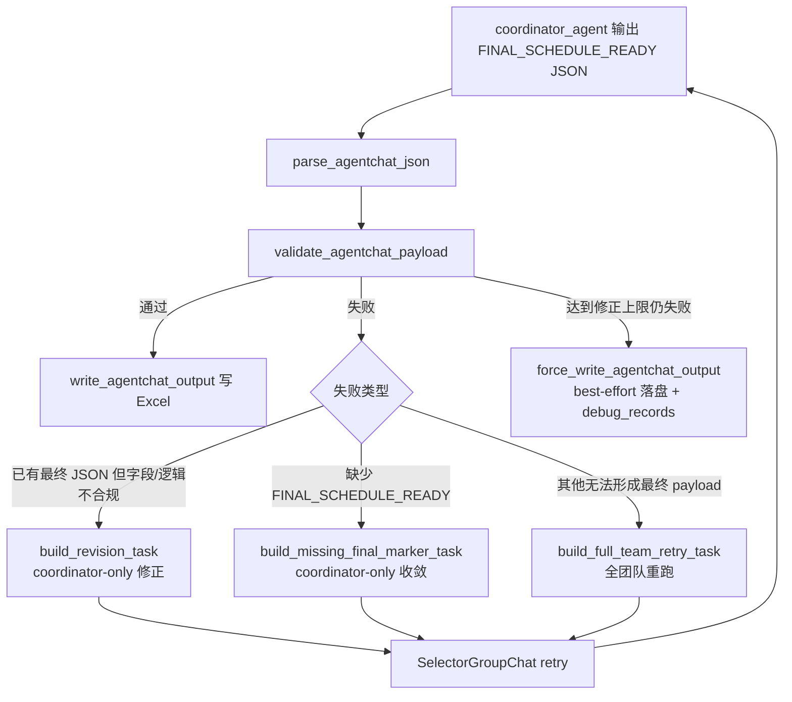

# 真实案例 Agent 数据流推测

本文根据当前代码推测 `python src/main_real_case_workflow.py` 接入真实案例资料后的数据流向。结论重点：真实案例主链路不是传统消息总线逐个转发大表，而是 AutoGen `SelectorGroupChat` 编排各 Agent，通过工具读真实资料、读写共享的内存草稿表，最后一次性校验并写入 Excel 公共黑板。

## 主流程图

## Agent 间数据方向

## 校验与重试回路

## 关键推断

- 入口数据来自 `data/input_docs/`，由 `read_source_documents` 读成 `SourceDocument`，支持文本、表格、Word、PDF、DXF/DWG 等资料。
- `build_agent_tools` 会先基于全文和结构化证据生成规则抽取结果，作为 `data_parser_agent` 的候选输入；这些不是 Agent 之间直接传消息，而是通过工具暴露给所有 Agent。
- 真实案例中间成果先进入 `draft_tables` 内存草稿表，`write_blackboard_table` 明确返回 `excel_written=false`；Excel 只在最终 JSON 通过本地校验后统一写入。
- `candidate_func` 按草稿表是否就绪决定下一位 Agent：参数 -> WBS -> 资源 -> 事件 -> 仲裁 -> 约束校核 / 总控交替。
- `constraint_checker_agent` 没有写表权限，只负责读草稿、指出阻塞问题；`coordinator_agent` 拥有所有目标草稿表写权限，并负责最终 `FINAL_SCHEDULE_READY` JSON。
- `write_agentchat_output` 是最终落盘枢纽：除六张核心表外，还补充证据表、审计表、质量门禁、初始进度、CPM、网络关系、里程碑、资源负载、资源冲突消解和约束校核结果。
- `config/events.yaml` 定义的是事件订阅式通信视角，更多用于 demo 和通信日志理解；真实案例主流程的实际路由由 `SelectorGroupChat` 和 `_build_candidate_func` 控制。

## 代码依据

- `src/main_real_case_workflow.py`：真实案例入口、资料读取、工作流运行和成果导出。
- `src/agentchat_runtime/workflow.py`：Agent 团队构建、工具权限、候选路由、重试逻辑、内存草稿表。
- `src/agentchat_runtime/output_writer.py`：最终 JSON 解析、校验、衍生排程计算和 Excel 落盘。
- `src/tools/document_tools.py`：真实资料读取和 evidence rows 构造。
- `src/blackboard/excel_store.py`、`src/blackboard/sheet_schema.py`：Excel 公共黑板读写与表结构契约。
